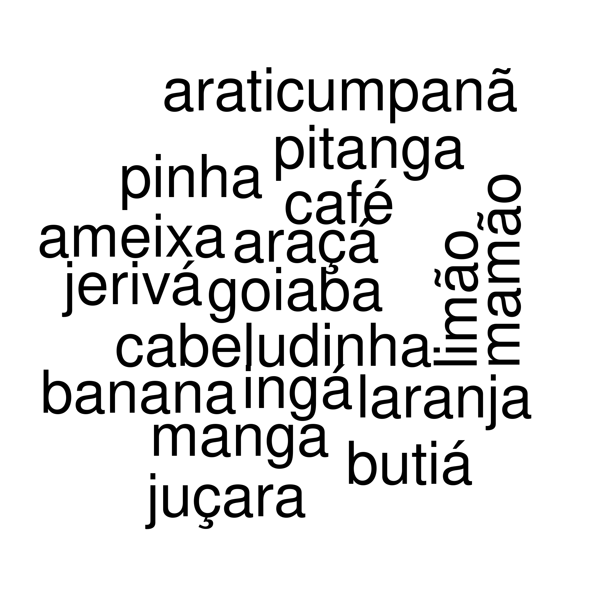
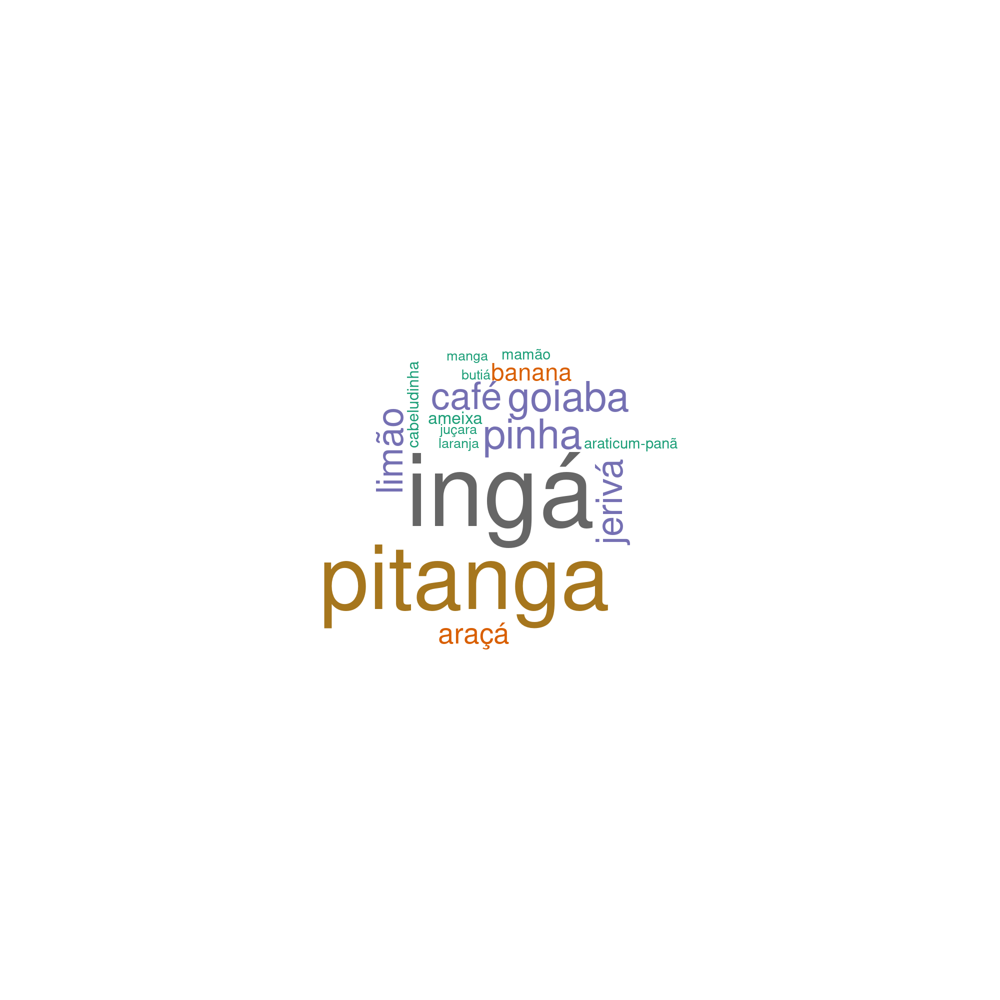

# Como fazer uma núvem de palavras simples?

#### Tutorial desenvolvido por Marcio Baldissera Cure.


#### Este tutorial vai te ensinar como criar uma núvem de palavras de forma simples utilizando o R e o RStudio.

- Se você ainda não tiver os pacotes instalados no seu computador, é preciso instalar o R e depois o RStudio. O R pode ser baixado [AQUI](https://www.r-project.org/) e o RStudio [AQUI](https://www.rstudio.com/products/rstudio/#rstudio-desktop).

#### Para criar uma núvem de palavras utilizei os dados do Projeto Frutos da Costa, uma iniciativa independente para mapear as árvores frutíferas em uma Comunidade Tradicional de pescadores artesanais em Florianópolis, SC. 

#### Os dados e as informações sobre o projeto estão disponíveis em <https://frutosdacosta.netlify.app>. Você também pode conhecer e acompanhar o projeto no Instagram: [@frutos_da_costa](https://www.instagram.com/frutos_da_costa/).

#### Este tutorial, assim como o script e os dados estão disponíveis em <https://github.com/Mauritia-flexuosa/word-cloud>.


- *Observação 1:* Eu utilizo (eventualmente) neste tutorial um recurso que pode ser encotrado dentro do pacote ```tidyverse``` que é o chamado _pipe_ (```%>%```). Ele encadeia funções. Talvez sua utilidade não fique bem clara neste tutorial, mas ele com certeza será útil no futuro, então, vá se acostumando. ;)

- *Observação 2:* Os parâmetros das funções, juntamente com as instruções para usá-las podem ser acessadas com o comando ```?função```, por exemplo ```?wordcloud```.

Ok, sem mais delongas...

## Vamos ao início:

- Abra o RStudio e escreva os comandos em um script do R.

- Para executar os comandos, coloque o cursor na linha de código ou selecione o texto do código e execute ```ctrl+ENTER```.

### 1. Carregar os pacotes necessários:


```{r}
library(tidyverse)
library(RColorBrewer)
library(wordcloud)
library(tm)
```

- Se os pacotes não forem previamente baixados, o comando ```library``` para carregar os pacotes não funcionará. É preciso usar a função ```install.packages```, com o nome do pacote entre aspas dentro dos parênteses. Exemplo: ```install.packages("RColorBrewer")```.

### 2. Carregar os dados:

- Primeiro, vamos atribuir a tabela chamada de _dados_1.txt_ a um objeto chamado de _dados_.


```{r}
dados <-  read.table("dados_1.txt", h = T)
```

- Note que o argumento que vai entre as aspas ("argumento") é o endereço do arquivo dentro do seu computador. O`s meus dados estão armazenados em uma tabela que está dentro do meu diretório de trabalho.

- Para ver o seu diretório de trabalho, ou seja, a pasta que o R entende que você está trabalhando, basta executar o comando ```getwd()```. Por exemplo, quando eu executo este comando, aparece a pasta do meu computador onde está a tabela de dados. Exemplo: ```r getwd()```:

```[1] "/home/marcio/PROJETOS-GIT/word-cloud"```

Você pode determinar a sua pasta de trabalho, ou seja, o seu diretório de trabalho, utilizando a função ```setwd()``` com o endereço da pasta entre aspas dentro do parênteses. Por exemplo, ```setwd("/home/Documentos/pasta1")```.


### 3. Explore os dados para ver se está tudo ok:

- Você pode explorar os dados de diferentes formas. Saiba o nome das colunas e o que tem nas linhas iniciais usando a função ```head```:

```{r}
dados %>% head 
```

```
nome_popular       nome_científico fase_ontogenetica srtm data_coleta
1        Limão             Citrus_sp            adulto  22m  2021-10-07
2        Pinha Annona_neosalicifolia            adulto  19m  2021-10-07
3       Jerivá Syagrus_romanzoffiana            adulto  21m  2021-10-07
4         Ingá          Inga_striata           juvenil  23m  2021-10-07
5         Café             Coffea_sp            adulto  24m  2021-10-07
6        Pinha Annona_neosalicifolia            adulto  24m  2021-10-07
              obs       lon       lat
1            <NA> -48.45746 -27.58093
2            <NA> -48.45745 -27.58080
3 dois_indivíduos -48.45745 -27.58077
4            <NA> -48.45742 -27.58075
5            <NA> -48.45731 -27.58069
6            <NA> -48.45733 -27.58062
```

O bom e velho ```str``` ainda vai mostrar a classe dos dados (_data.frame_), número de observações, número de variáveis, quem são essas variáveis e alguns valores iniciais.

```{r}
dados %>% str
```

```
'data.frame':	297 obs. of  8 variables:
 $ nome_popular     : chr  "Limão" "Pinha" "Jerivá" "Ingá" ...
 $ nome_científico  : chr  "Citrus_sp" "Annona_neosalicifolia" "Syagrus_romanzoffiana" "Inga_striata" ...
 $ fase_ontogenetica: chr  "adulto" "adulto" "adulto" "juvenil" ...
 $ srtm             : chr  "22m" "19m" "21m" "23m" ...
 $ data_coleta      : chr  "2021-10-07" "2021-10-07" "2021-10-07" "2021-10-07" ...
 $ obs              : chr  NA NA "dois_indivíduos" NA ...
 $ lon              : num  -48.5 -48.5 -48.5 -48.5 -48.5 ...
 $ lat              : num  -27.6 -27.6 -27.6 -27.6 -27.6 ...
 ```

Mas o ```summary``` também é uma opção. Ele mostra as variáveis, número de observações, classe e a distribuição dos dados numéricos com valores máximos, mínimos, média, mediana e os demais quartis.

```{r}
dados %>% summary
```

```
nome_popular       nome_científico    fase_ontogenetica      srtm          
 Length:297         Length:297         Length:297         Length:297        
 Class :character   Class :character   Class :character   Class :character  
 Mode  :character   Mode  :character   Mode  :character   Mode  :character  
                                                                            
                                                                            
                                                                            
 data_coleta            obs                 lon              lat        
 Length:297         Length:297         Min.   :-48.46   Min.   :-27.58  
 Class :character   Class :character   1st Qu.:-48.46   1st Qu.:-27.58  
 Mode  :character   Mode  :character   Median :-48.46   Median :-27.57  
                                       Mean   :-48.46   Mean   :-27.57  
                                       3rd Qu.:-48.46   3rd Qu.:-27.57  
                                       Max.   :-48.46   Max.   :-27.57  
```

### 4. Agora, vamos pegar o texto e criar um vetor para podermos organizar nossos dados e para que eles possam ser processados por outras funções, pois as funções, muitas vezes, trabalham com classes de objetos diferentes.

- para ver a classe de um objeto, use a função ```class()``` com o objeto dentro dos parênteses. Por exemplo, veja abaixo que a classe do objeto (_dados_) que armazenamos os nossos dados é um ```data.frame```. 

```{r}
class(dados)
```

```[1] "data.frame"```

- Transformando para vetor ou para a classe ```VectorSource```:

```{r}
vetorTexto <- VectorSource(dados$nome_popular)
```
 
### 5. Representa o vetor como um corpus de texto:

- Agora, vamos pegar esse vetor que colocamos dentro do objeto chamado _vetorTexto_ e passar para a classe _Corpus_.

```{r}
corpusTexto <- Corpus(vetorTexto)
```

### 6. Constrói uma classe chamada de __term-document matrix_

- Esta etapa computa a frequência com que aparecem os termos dentro do corpus de texto e muda mais uma vez a classe do objeto que estamos trabalhando (não será a última). 

```{r}
dtm <- TermDocumentMatrix(corpusTexto)
```

### 7. Transforma em matriz

- A partir do term-document matrix, vamos construir uma matrix  (i.e. classe 'matrix') binária com presença e auxência onde cada linha é uma "palavra" e cada coluna é uma unidade amostral.

```{r}
matrix <- as.matrix(dtm)

```


### 8. Soma o número de linhas e coloca em ordem decrescente.

```{r}
words <- sort(rowSums(matrix),decreasing=TRUE) 
```

### 9. De volta à classe original

- Cria um data frame com as palavras em uma coluna e a frequência das palavras na outra.

```{r}
df <- data.frame(word = names(words),freq=words)
```

- Demos toda essa volta para voltarmos nosso objeto para a classe 'data frame'? Sim, mas os dados não são mais os mesmos. Com todos os passos anteriores, fizemos diversas transformações até aqui para extrairmos o que a função ```wordcloud``` necessita para gerar a núvem de palavras.

### 10. Plote uma núvem de palavras simples.

- Finalmente, visualize a núvem de palavras. É a núvel mais simples, mas mesmo assim já é alguma coisa.

```{r}
wordcloud(df$word)
```


### 11. Melhorando a nossa núvem

- Tudo começa simples, porém nós não nos contentamos com essa simplicidade, pois essa núvem só nos mostra as diferentes palavras. Só isso! Queremos mais informações sendo transmitidas por este recurso visual, certo? Uma núvem de palavras pode nos dizer mais. Por exemplo, para sabermos qual palavra possui a maior frequência de ocorrências, ou para visualizarmos a diferença relativa de frequência entre as palavras bastaria que o tamanho das palavras na núvem fossem proporcionais à frequência de ocorrência.

- Então vamos deixar a núvem bonita ajustando os parâmetros da função que gera essa núvem.

```{r}
wordcloud(words = df$word, freq = df$freq,min.freq = 1, max.words=130, random.order=FALSE,rot.per=0.25, colors=brewer.pal(8, "Dark2"))
```



Podemos notar claramente as palavras mais frequêntes, ou seja, as árvores frutíferas que mais encontramos, que são o Ingá e a Pitanga.

### 12. Salvando a núvem para formato de imagem.

- Para salvar a núvem de palavras no formato png, por exemplo, vamos utilizar a função ```png```. Entretanto, existem outras funções para salvar imagens geradas no R, como gráficos, mapas e outras figuras.

```{r}
png("nuvem_de_palavras.png", res = 300, width = 2000, height = 2000)

wordcloud(words = df$word, freq = df$freq,
min.freq = 1, max.words=130, random.order=FALSE, rot.per=0.25,
colors=brewer.pal(8, "Dark2"))

dev.off()
```

#### **Pronto, está feita e salva a sua núvem de palavras.**

</DIV>

#### Agora tente criar uma núvem com outros dados. Qualquer dúvida, entre em contato:

</DIV>

<footer><p class="small">

<h3>Contatos:</h3>

<div>
<a href = "mailto:marciobcure@gmail.com"></a>
 <a href="https://instagram.com/marciobcure" target="_blank"></a>
</div>
</p></footer>
